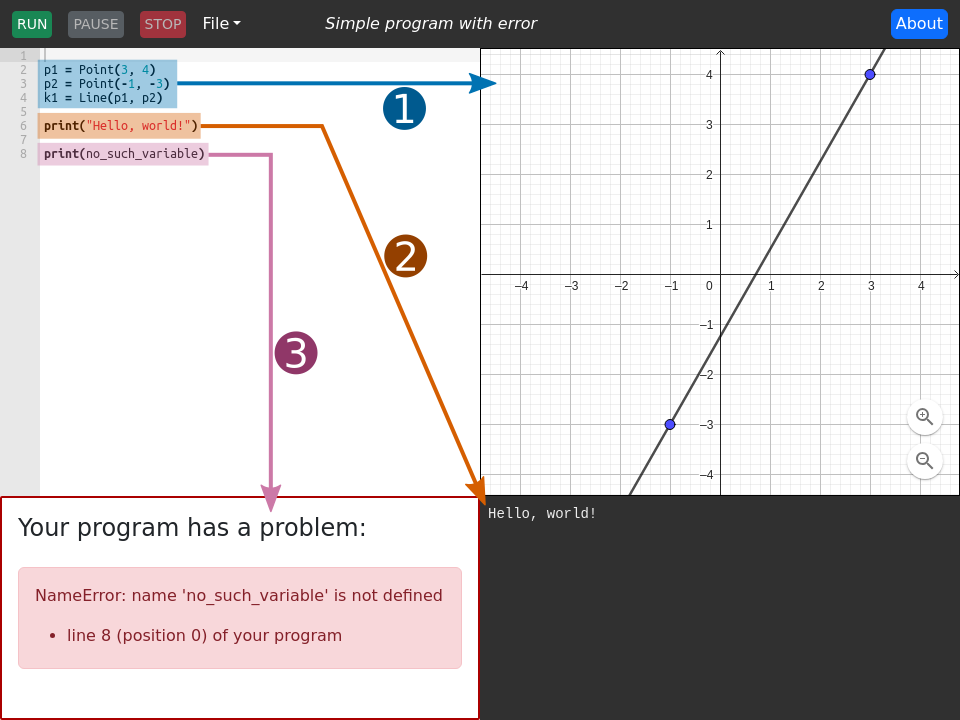

The PyGgb interface
===================

The webapp interface is as follows:

and is made of five parts:

Command bar
-----------

Across the top of the interface is the *command bar*.  It contains the
program control buttons, the :guilabel:`File` menu, the name of the
program you are currently working with, and the :guilabel:`About`
button.

Program control buttons
~~~~~~~~~~~~~~~~~~~~~~~

To run your Python program, click the :guilabel:`Run` button.  You can
stop your program altogether with the :guilabel:`Stop` button.  While
your program is running, you can use the :guilabel:`Pause` button to
pause it, after which you can resume it with :guilabel:`Run` or
abandon its execution with :guilabel:`Stop`.

See :ref:`pausing-resuming-and-stopping` for more details on exactly
when you can pause a Python program.

Python editor
-------------

The left panel.  Or, if an error has occurred, the top-left panel.

Edit your Python program here.

GeoGebra pane
-------------

The top-right panel.

|circle-1| When you press the :guilabel:`Run` button, your Python
program will run, and any GeoGebra objects it creates will be shown
here.

The GeoGebra pane has the standard GeoGebra interactivity — you can
pan and zoom, and move "free" objects.

Console output pane
-------------------

The bottom-right panel.

|circle-2| If your Python program prints anything, the output will
appear here.

Error pane
----------

The bottom-left panel.  Only exists if your program has encountered an
error.

|circle-3| If your Python program contains an error, details will be
shown here.  If there are no errors, the error pane is not shown, and
the Python editor takes up the entire left column of the interface.

